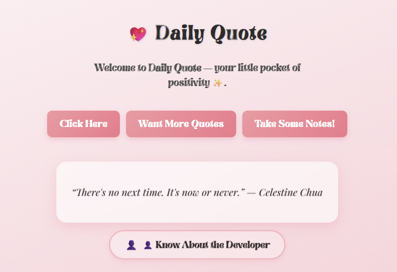
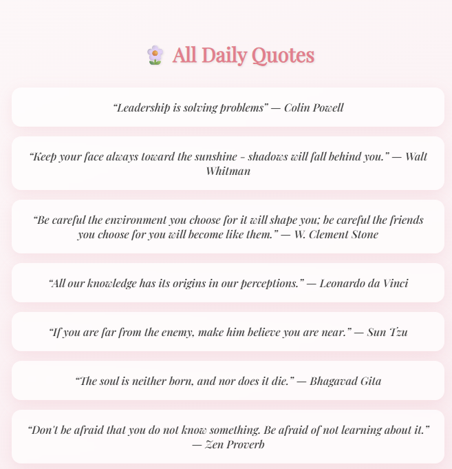
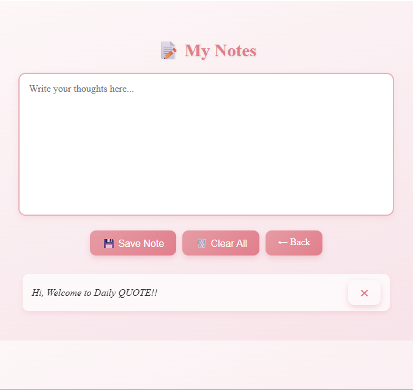
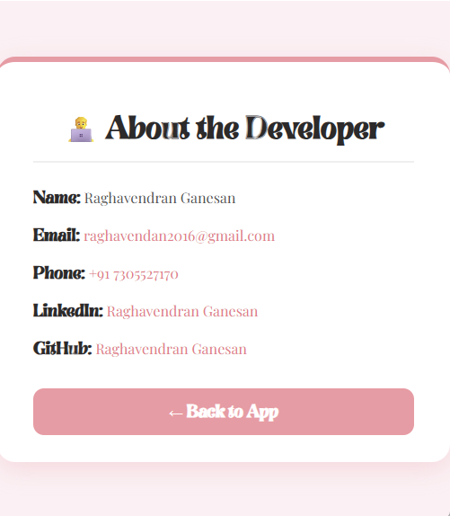

<h1 align="center">💖 Daily Quote — Electron Desktop App</h1>

  
  

<h2>🌸 Introduction</h2>

<b>Daily Quote</b> is a beautifully designed <b>Electron-based desktop application</b> that brings you a fresh dose of inspiration every day ✨.  
It combines a soft pastel interface, smooth animations, and live quote fetching from public APIs to create a calm and uplifting user experience.

<h2>⚙️ Features</h2>

<ul>
  <li>💬 <b>Random Daily Quotes</b> — Fetches real-time motivational quotes from <a href="https://zenquotes.io/">ZenQuotes API</a>.</li>
  <li>📜 <b>Quote List</b> — View multiple inspirational quotes in a clean, scrollable window.</li>
  <li>📝 <b>Notes Section</b> — Take short notes or reflections while viewing quotes.</li>
  <li>👤 <b>About Developer</b> — A neat pop-up window displaying creator information.</li>
  <li>🌈 <b>Pastel UI</b> — Elegant typography with soft gradient backgrounds and animated quote box.</li>
  <li>💻 <b>Offline Support</b> — Works even without internet (displays saved quotes).</li>
</ul>

<h2>🧠 Logic Used</h2>

The app is built using a combination of <b>ElectronJS</b> and vanilla <b>HTML, CSS, and JavaScript</b>.

<ul>
  <li>🚀 The <b>main process</b> (in <code>main.js</code>) handles the app window and controls multiple HTML pages (index, quotes, notes, about).</li>
  <li>🌐 The <b>renderer process</b> fetches live quotes from the ZenQuotes API using <code>fetch()</code>.</li>
  <li>🎨 CSS animations</li>
  <li>📦 Packaged with <b>Electron Packager</b> into a standalone Windows executable (.exe).</li>
</ul>

<h2>🖼️ Screenshots</h2>

<table>
  <tr>
    <td align="center">
       
      <b>✨ Home Screen</b>
    </td>
    <td align="center">
       
      <b>🌸 All Quotes Page</b>
    </td>
  </tr>
  <tr>
    <td align="center">
       
      <b>🌸 Take Notes !</b>
    </td>
    <td align="center">
       
      <b>Know about the developer</b>
    </td>
  </tr>
</table>

<h2>🧰 Tech Stack</h2>

<ul>
  <li>⚛️ <b>ElectronJS</b> — Cross-platform desktop framework</li>
  <li>🎨 <b>HTML5 + CSS3</b> — UI layout and animations</li>
  <li>🧩 <b>JavaScript (Vanilla)</b> — Core functionality and API integration</li>
  <li>🌐 <b>ZenQuotes API</b> — For real-time quote fetching</li>
</ul>

<h2>🚀 How to Run the App Locally</h2>

<pre>
# Clone the repository
git clone https://github.com/yourusername/DailyQuoteApp.git

# Go inside the folder
cd DailyQuoteApp

# Install dependencies
npm install

# Run the app
npm start
</pre>

---

<h2>📦 Build Your Own Executable (.exe)</h2>

<pre>
npx electron-packager . "Daily Quote" --platform=win32 --arch=x64 --icon=icon.ico --out=build --overwrite
</pre>

---

<h2>📥 Download the App</h2>

👉 <a href="https://github.com/yourusername/DailyQuoteApp/releases" target="_blank"><b>Download Latest Version (Windows)</b></a>

